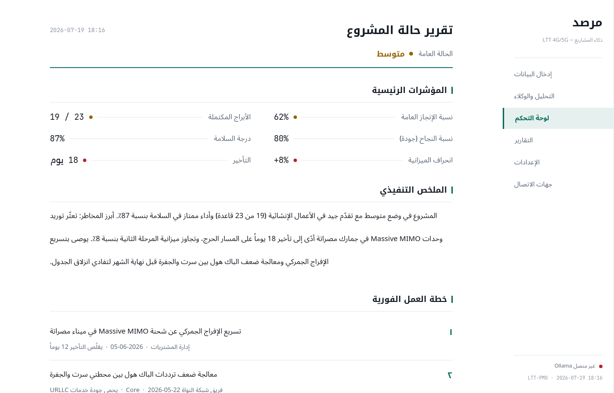
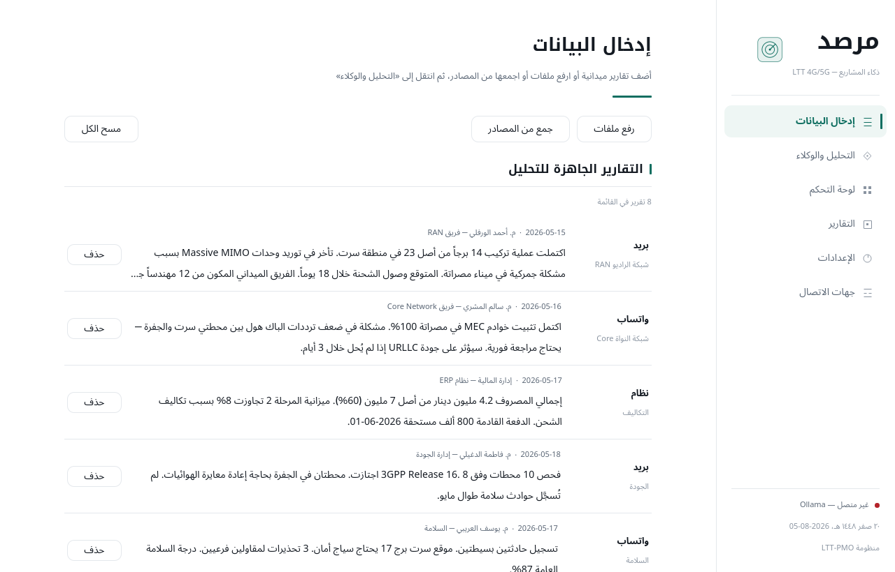
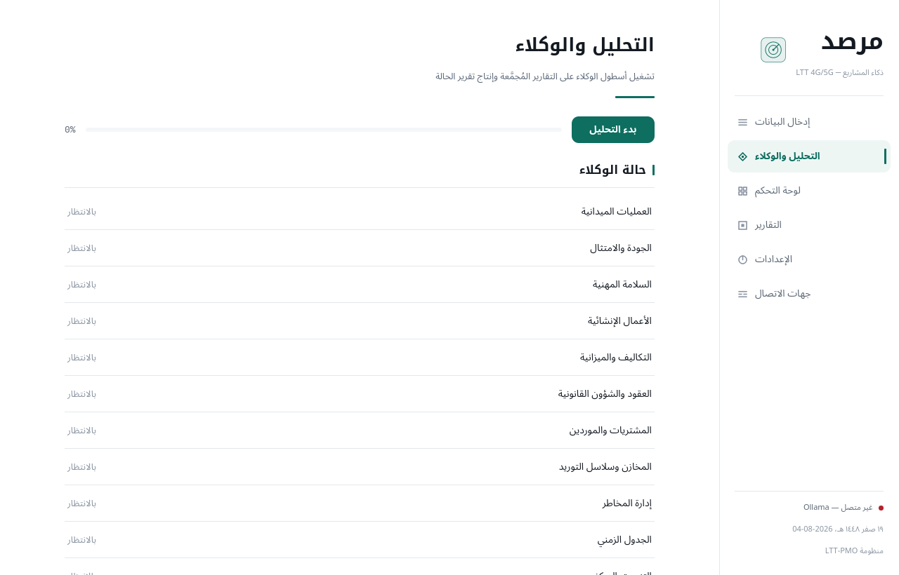
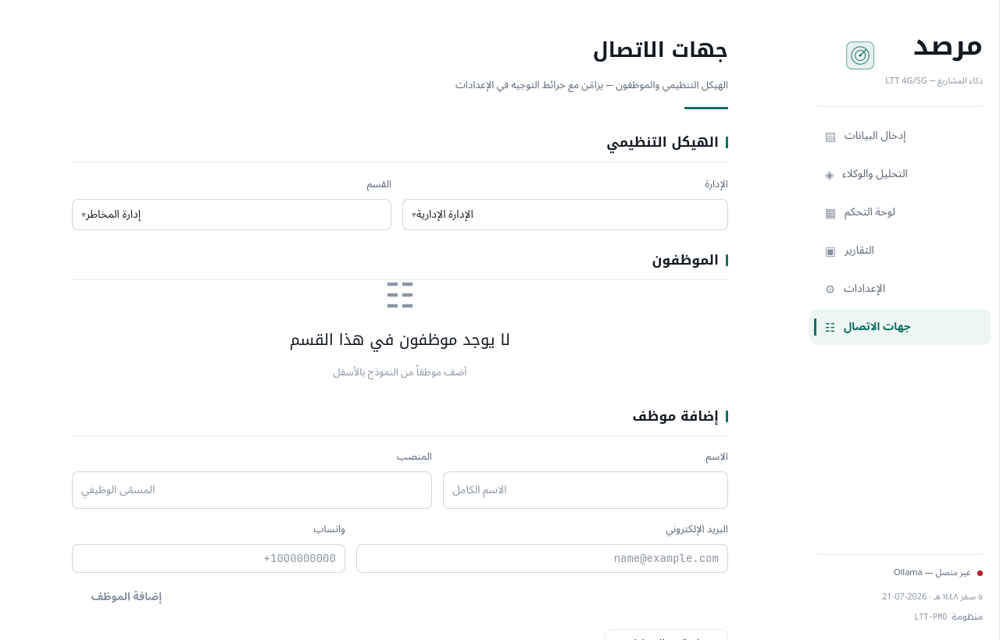
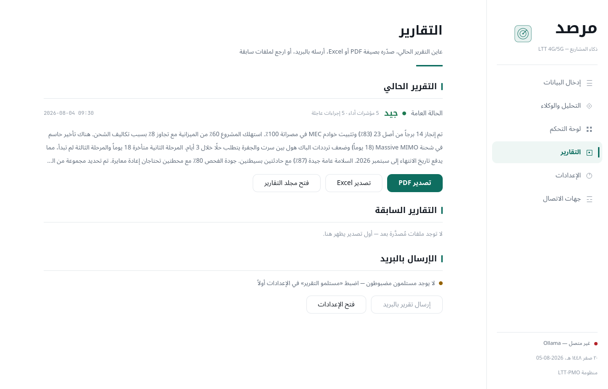
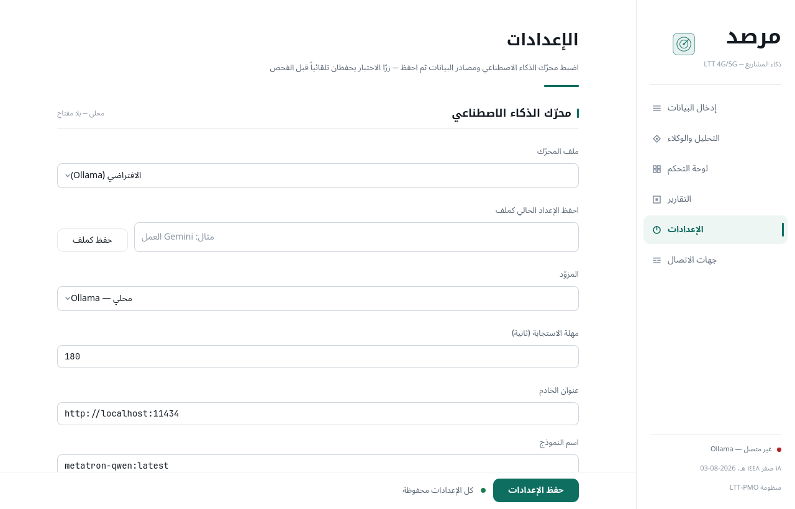
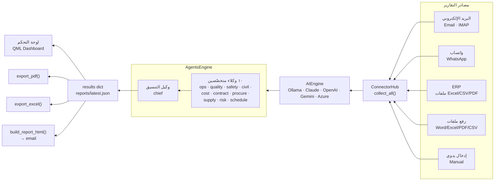

<div align="center">

# مرصد · marsad

**LTT 4G/5G Project-Management Intelligence — Arabic (RTL) desktop app**

Ingests field reports from email · WhatsApp · ERP · uploaded files, runs them through a fleet of
LLM agents, and produces an executive status brief plus branded PDF / Excel / HTML reports.

Qt Quick / QML · PySide6 · Ollama · Claude · OpenAI · Gemini · Azure

</div>

---

## Screens

| لوحة التحكم — Dashboard | إدخال البيانات — Input |
|:--:|:--:|
|  |  |
| **التحليل والوكلاء — Analysis** | **جهات الاتصال — Contacts** |
|  |  |
| **التقارير — Reports** | **الإعدادات — Settings** |
|  |  |

An Arabic-forward executive brief: white paper, near-black ink, one deep teal-green accent, and a
right-hand RTL sidebar with a Kufi wordmark and a dual **Hijri · Gregorian** date. Colour is rationed to
a single status dot per metric, and structure comes from hairline rules — not cards. Arabic is shaped
and ordered correctly by Qt (HarfBuzz + BiDi); the dashboard opens with a three-step quick-start until
the first analysis runs.

## Status

Verified end to end on 2026-08-05: a full 11-agent analysis over eight field reports completed
against a live model with no errors, and its output exported to PDF, Excel and HTML. The
screenshots below are that run — not mock data.

| Area | State |
|---|---|
| Analysis engine — 5 providers (Ollama · Claude · OpenAI-compatible · Gemini · Azure) | Verified against a live model; per-provider request shapes covered by tests |
| PDF · Excel · HTML export | Verified against real model output |
| Email — IMAP collection | Verified against a real mailbox |
| Email — SMTP send | Message construction verified byte-for-byte (Arabic subject, UTF-8 HTML, intact attachments, verified TLS); the network hop to a live inbox is the one thing left untried |
| WhatsApp receiver + Baileys bridge | Verified with a real linked device |
| File upload — `xlsx · csv · pdf · txt · json · docx` | Each format round-trips in tests |
| Packaging — Windows installer, portable `.exe`, Debian `.deb` | Built in CI on a `v*` tag |

185 tests (`python3 -m unittest discover -s tests`). `docs/RELEASE_CHECKLIST.md` gates a release.

**First run** starts empty by design: no recipients, no routing maps, no sample data. Configure the
engine in **الإعدادات**, add people in **جهات الاتصال**, then «مزامنة مع الإعدادات» to build the
email/WhatsApp → department routing. Nothing is sent anywhere until you set a recipient.

## How it works



The `results` dict — keyed by agent id (`chief`, `risk`, `cost`, `schedule`, …) — is the single
contract every layer reads. Ten domain agents analyse the reports; the `chief` agent aggregates their
output into `overall_health`, `executive_summary`, `kpis`, and `top_actions`.

## Install & run

Needs **Python 3.10+** and one AI backend — a local Ollama model, or an API key for Claude, OpenAI (or
any OpenAI-compatible endpoint), Gemini, or Azure OpenAI.

### Source (Windows · macOS · Linux)

```bash
git clone https://github.com/mohammed3200/marsad.git
cd marsad
python3 -m venv .venv && source .venv/bin/activate      # Windows: .venv\Scripts\activate
pip install -r requirements.txt
cp settings.example.json settings.json                   # one-time bootstrap; configure the rest in the app
python app.py
```

### Installers (from the Releases page)

Grab a prebuilt package from the [latest release](https://github.com/mohammed3200/marsad/releases/latest):

- **Windows:** `marsad-setup-<version>.exe` (NSIS installer) or `marsad-<version>-portable.exe` (portable, no install).
- **Debian / Ubuntu:** `marsad_<version>_amd64.deb` — `sudo apt install ./marsad_<version>_amd64.deb`.

Build them yourself with **PyInstaller**:

```bash
pip install -r requirements.txt pyinstaller
pyinstaller marsad.spec                       # → dist/marsad/
bash packaging/linux/build_deb.sh 1.0.0       # → dist/marsad_1.0.0_amd64.deb  (needs dpkg-deb)
```

Windows installers are built in CI: pushing a `v*` tag runs `.github/workflows/build.yml`, which builds
the NSIS installer + portable `.exe` (Windows) and the `.deb` (Linux) and attaches them to the release.
An installed app keeps its config, reports, and contacts under a per-user data dir
(`%APPDATA%/marsad`, `~/.local/share/marsad`).

## Connect a backend

Everything is configured from the **الإعدادات** (Settings) tab in the app — **no manual JSON editing**
(the `cp` above is a one-time bootstrap so the app has a config file on first run).
Pick the provider from the **المزوّد** dropdown; the tab shows only that provider's fields.

| Provider | Notes |
|---|---|
| **Ollama** (local, default) | `ollama pull llama3.2`; set the URL/model. Runs offline. |
| **Claude API** | Paste your key (`claude-opus-4-5` by default). |
| **OpenAI / compatible** | One adapter with an editable **Base URL** + preset picker — OpenAI, OpenRouter, Groq, Together, DeepSeek, LM Studio, or a custom endpoint. |
| **Google Gemini** | Paste your key (`gemini-2.0-flash` by default). |
| **Azure OpenAI** | Endpoint + deployment + key + api-version. |

**Response timeout** — `مهلة الاستجابة` (default 180s); raise it for large/slow local models. «اختبار المحرّك»
tests whichever provider is selected.

### Data sources (all UI-configured)

| Source | How to enable |
|---|---|
| **Manual entry** | Type/paste a report on the **إدخال البيانات** tab. |
| **File upload** | «رفع ملفات» — pick `xlsx · csv · pdf · txt · json · docx`. |
| **Email (IMAP/SMTP)** | Fill the **البريد الإلكتروني** section (user, password, hosts, port, recipients), press «اختبار البريد», then «جمع من المصادر» pulls new mail. |
| **ERP folder** | Point the **مجلد ERP** picker at a shared folder; any dropped file is read on «جمع من المصادر». |
| **WhatsApp** | Enable it in Settings, «توليد ملف الجسر», then run the generated `whatsapp_bridge.js` once (`npm install && node whatsapp_bridge.js`, scan the QR). Group messages then flow in. **Receive-only** — marsad reads group messages, it never sends any. |

«اختبار المحرّك» tests the AI engine in two stages — it first checks the server is reachable, then that
the model actually answers within `مهلة الاستجابة`, so a slow model is distinguishable from a dead
endpoint. «اختبار البريد» tests email, both legs: IMAP (what collection uses) and SMTP login (what
sending uses). It sends no message.

## Data & privacy

`settings.json`, `data/contacts.json`, `reports/`, and `logs/` are **gitignored** — they hold live
config and output and never ship. `settings.example.json` (blank credentials) is the template. Contacts
entered in the app sync their email/WhatsApp → department routing back into `settings.json` via the
**مزامنة مع الإعدادات** button.

- **Uploaded files** picked in the desktop app are read in place from wherever you picked them —
  no copies are made — marsad reads the file where you picked it and keeps no copy.
- **WhatsApp session** — «توليد ملف الجسر» writes `whatsapp_bridge.js` (with the per-session
  `X-WA-Token`, also stored as `whatsapp_token` in `settings.json`), and running it creates
  `wa_session/` holding your live WhatsApp login. Both live under the per-user data dir
  (`%APPDATA%/marsad`, `~/.local/share/marsad`; the repo folder when run from source), are
  gitignored, and stay until you delete them — delete both to revoke the linked device.

  **The bridge talks to Meta.** It is a Baileys WhatsApp Web client: starting it opens an outbound
  connection to WhatsApp's servers (handshake, credential sync, keepalive, reconnect) and downloads
  message media from WhatsApp's CDN. "Receive-only" describes the *messages* — marsad never sends
  one — not the socket, which is necessarily two-way. The first start also runs `npm install`,
  fetching the bridge's dependencies from the npm registry. The receiver marsad itself runs stays on
  `127.0.0.1` and still requires the `X-WA-Token` header.
- **Reports & logs** — analysis results (`reports/`) and connector/engine logs (`logs/`) accumulate
  locally until you delete them.

**What leaves the machine:** calls to your configured LLM provider (none, if you run Ollama
locally), your email server if email is configured, and — only once you start the WhatsApp bridge —
WhatsApp's servers and the npm registry, as described above. WhatsApp is off by default
(`whatsapp_enabled: false`) and nothing reaches Meta until you start the bridge yourself.

## Project layout

```
app.py                 Qt entry — loads qml/Main.qml
core/                  UI-agnostic logic (engine, contacts, exporters, hijri dates)
connectors.py          email / ERP / WhatsApp ingestion + outbound email
backend/               Qt bridge — theme, controller, worker, models, settings
qml/                   Light-report UI — Main + 6 pages + flat primitives
assets/fonts/          bundled Arabic + mono fonts (OFL)
tools/                 capture_qt.py (screenshots) · build_linux.sh
```

See [CLAUDE.md](CLAUDE.md) for the full architecture and conventions.

## License

Code: see [LICENSE](LICENSE). Bundled fonts: SIL Open Font License 1.1 — see
[assets/fonts/LICENSES.md](assets/fonts/LICENSES.md).
