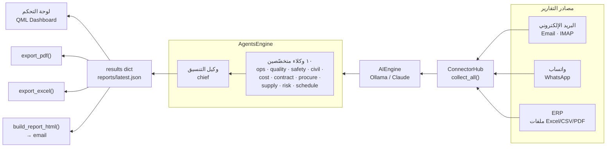

<div align="center">

# مرصد · marsad

**LTT 4G/5G Project-Management Intelligence — Arabic (RTL) desktop app**

Ingests field reports from email · WhatsApp · ERP, runs them through a fleet of LLM agents,
and produces an executive status brief plus branded PDF / Excel / HTML reports.

Qt Quick / QML · PySide6 · Ollama or Claude

</div>

---

## Screens

| لوحة التحكم — Dashboard | إدخال البيانات — Input |
|:--:|:--:|
|  |  |
| **التحليل والوكلاء — Analysis** | **جهات الاتصال — Contacts** |
|  |  |
| **التقارير — Reports** | **الإعدادات — Settings** |
|  |  |

The interface reads as a light executive brief: white paper, near-black ink, one deep teal-green
accent, a right-hand RTL sidebar, and colour rationed to a single status dot per metric. Arabic is
shaped and ordered correctly by Qt (HarfBuzz + BiDi).

## How it works



The `results` dict — keyed by agent id (`chief`, `risk`, `cost`, `schedule`, …) — is the single
contract every layer reads. Ten domain agents analyse the reports; the `chief` agent aggregates their
output into `overall_health`, `executive_summary`, `kpis`, and `top_actions`.

## Install & run

Needs **Python 3.10+** and a running LLM backend (Ollama or Claude).

### Source (Windows · macOS · Linux)

```bash
git clone https://github.com/<you>/marsad.git
cd marsad
python3 -m venv .venv && source .venv/bin/activate      # Windows: .venv\Scripts\activate
pip install -r requirements.txt
cp settings.example.json settings.json                   # then edit it
python app.py
```

### Standalone binaries

- **Linux:** `bash tools/build_linux.sh` → `dist/marsad` (needs `patchelf`: `sudo apt install patchelf`).
- **Windows `.exe` / Linux binary via CI:** push a `v*` tag — `.github/workflows/build.yml` builds both
  with `pyside6-deploy` and attaches them to the GitHub release.

## Connect a backend

Edit `settings.json`:

**Ollama (local, default)** — install [Ollama](https://ollama.com), pull a model, then:
```json
{ "ai_backend": "ollama", "ollama_url": "http://localhost:11434", "ollama_model": "llama3.2" }
```
```bash
ollama pull llama3.2      # or any instruct model that returns JSON
```

**Claude API**
```json
{ "ai_backend": "claude", "claude_api_key": "sk-ant-…", "claude_model": "claude-opus-4-5" }
```

Test the connection from the **الإعدادات** (Settings) tab. Analysis speed depends on the model and
hardware — large local models may need a longer timeout.

## Data & privacy

`settings.json`, `data/contacts.json`, `reports/`, and `logs/` are **gitignored** — they hold live
config and output and never ship. `settings.example.json` (blank credentials) is the template. Contacts
entered in the app sync their email/WhatsApp → department routing back into `settings.json` via the
**مزامنة مع الإعدادات** button.

## Project layout

```
app.py                 Qt entry — loads qml/Main.qml
core/                  UI-agnostic logic (engine, contacts, exporters)
connectors.py          email / ERP / WhatsApp ingestion + outbound email
backend/               Qt bridge — theme, controller, worker, models, settings
qml/                   Light-report UI — Main + 6 pages + flat primitives
assets/fonts/          bundled Arabic + mono fonts (OFL)
tools/                 capture_qt.py (screenshots) · build_linux.sh
```

See [CLAUDE.md](CLAUDE.md) for the full architecture and conventions.

## License

Code: see [LICENSE](LICENSE). Bundled fonts: SIL Open Font License 1.1 — see
[assets/fonts/LICENSES.md](assets/fonts/LICENSES.md).
